# Smart Notes AI Application

## Overview

A full-stack note-taking application featuring secure user authentication, full CRUD functionality, and an AI-powered note summarization feature.

Live Demo: <a href="https://technicaltestpointstar.onrender.com/">https://technicaltestpointstar.onrender.com/</a>

## Core Feature

- Secure Authentication: Full sign-up, login, and logout flow using a JWT accessToken and a secure HttpOnly refresh token for persistent sessions and enhanced security. Includes email verification and password reset functionality.
- Full Notes CRUD: Users can create, read, update, and delete their personal notes in a clean dashboard interface.
- AI-Powered Summarization: Instantly generate a summary of any note's content using an integrated AI API. It's just one click away
  0

## Architectural Decisions & Design Rationale

### Backend Architecture

1. Depdency Injection with Awilix
   - Rationale: Makes the system modular easier to maintain or replace in the future
2. Service-Repository Pattern
   - Rationale: Separation of concrn between service layer where business rules do in here. The repository layers handle database operations
3. Secure HttpOnly cookie for refresh token
   - Rationale:I am thinking of preventing XSS attacks.
4. Putting the

### Frontend Architecture

1. Separation of concern of server state and client state
   - Rationale: Tanstack query is used for all server state and zustand is used for global client state (auth status)
2. Feature grouping
   - Rationale: easy to add new feature, all you need to do is just to add a new folder and directly code id.

### AI Rationale

Github offers free AI models that developers could use to develop a generative AI application. For this application i am using
**OpenAI GPT-4o mini**

#### Rationale:

1. Could have 150 request per day
2. With copilot pro. I could have 8000 tokens in and 4000 tokens out per request
3. Easy integration. they offer a great documentation: <a href="https://github.com/marketplace/models/azure-openai/gpt-4o-mini">https://github.com/marketplace/models/azure-openai/gpt-4o-mini</a>

## Overview

This document provides a comprehensive overview of the server-side of the **Notes App with Artificial Intelligence**. The server is built with Node.js and Express.js, and it uses a PostgreSQL database with Prisma as the ORM.

## Project Structure and tech stack

### A. Project structure

The server-side codebase is organized into the following main directories:

- **`src`**: This is the main directory containing the application's source code.
  - **`api`**: This directory contains the API-related files, including routes, controllers, and middleware.
  - **`config`**: This directory contains the application's configuration files.
  - **`core`**: This directory contains the core business logic of the application, including services and repositories.
  - **`infra`**: This directory contains the infrastructure-related code, such as database connections, logging, and security middleware.
  - **`test`**: This directory contains the tests for the application.
- **`prisma`**: This directory contains the Prisma schema and migration files.
- **`public`**: This directory contains the static files that are served by the application.

### B. Tech stack

- Express.js
- Prisma
- awilix
- bcrypt
- dotenv
- zod
- for detailed see package.json

## Features

The server-side of the application provides the following features:

- **User Authentication**: The application provides a secure user authentication system using JWTs, and refresh token.
- **Note Management**: The application allows users to create, read, update, and delete notes.
- **Artificial Intelligence**: The application uses AI to provide a summary of the notes.
- **API Documentation**: The application provides API documentation.

## Getting Started

### A. Setup your .env.

you need to fill these things so you can run. i Know we haven't downloaded the project. but when writing this md. i feel like the most important want is .env. so create a file. save it in your computer and lateron we will copy it to the project. thank you.

```
NODE_ENV=development
PORT=3000

#Databse
DATABASE_URL=<insert here>
#i use posgres will be explained below

# Auth security
JWT_SECRET=<insert here>
JWT_REFRESH_SECRET=<insert here>
JWT_ACCESS_TTL=15m             #  “15m” or “1h”
JWT_REFRESH_TTL=7d
BCRYPT_ROUNDS=12


# MAILER SETTING
# For this project, I used gmail smpt
SMTP_HOST=<insert here>
SMTP_PORT=<insert here>
SMTP_USER=<insert here>
SMTP_PASS=<insert here>
EMAIL_FROM=<insert here>"

LOG_LEVEL=debug
COMMIT_SHA=local-dev

#Deployment URL
DEVELOPMENT_URL=http://localhost:3000/verify-email?token
DEVELOPMENT_URL_CHANGEPASSWORD=http://localhost:3000/api/v1

# AI Setting
# For this project i used
# Can see this documentation for this setup
# https://github.com/marketplace/models/azure-openai/o4-mini
MODEL_TOKEN=<Use your github token>
AI_ENPOINT="https://models.github.ai/inference"
MODEL_NAME="openai/gpt-4o-mini" # You can change this to your own model
```

### B. Download projcet

To get started with the server-side of the application, you need to have visual-studio code, Node.js and PostgreSQL installed on your machine. Furthermore, you need to have a folder. Inside that folder you need to:

1. **Clone the application from github**
   ```
   git clone https://github.com/abrahamparn/TechnicalTestPointStar.git
   ```
2. **Install the dependencies**:

   ```bash
   cd .\TechnicalTestPointStar\server\
   npm install
   ```

3. **Set up the database**:

   Create a `.env` file in the root of the `server` directory and add the following environment variables:

   ```
   DATABASE_URL="postgresql://<user>:<password>@<host>:<port>/<database>"
   ```

4. **Run the migrations**:

   Make sure you have a database ready. you don't need to add a table

   ```bash
   npx prisma migrate dev
   ```

5. **Start the server**:

   ```bash
   npm run dev
   ```

The server will be running on `http://localhost:3000`.

## API Endpoints

The application exposes the following API endpoints:

_NOTES_ all of the note api needs to have authentication

- **`POST /api/v1/auth/register`**: Register a new user.
  - This requires you to have
    ```
    {
        "email":"", // a vaild email
        "name":"", // a valid name
        "username":"makanan", // minimum 5 character
        "password":"", // minimum 8 character
    }
    ```
  - the response could be like this
    ```
    {
        "success": true,
        "message": "Registration successful. Please check your email to verify your account."
    }
    ```
- **`Get /api/v1/auth/verify-email`**: email verification purposes
  - This use for verification purposes from the email that you get.
    ```
    {
        "success": true,
        "message": "Email Verified, You can login now."
    }
    ```
- **`POST /api/v1/auth/login`**: Log in a user.
  - Will give you accesstoken and give you cookie
  - Example body:
    ```
    {
        "email":"", //valid email
        "password":"" //previously set password
    }
    ```
  - example response:
    ```
    {
        "success": true,
        "accessToken": "" //valid token
    }
    ```
- **`POST /api/v1/logOut`**: will log out and increment the refresh_token_version so that you cannot use the same tokenS
  - will return
    ```
    {
        "success": true
    }
    ```
- **`POST /api/v1/refresh`\***: will return a new token and if refhresh token is expired will return error

  ```

  ```

- **`GET /api/v1/note`**: Get all the notes for the authenticated user.

  - Example body:
    ```
    {
        "success": true,
        "notes": [
            {
                "note_id": 1,
                "title": "",
                "content": "",
                "tags": [],
                "sentiment": null,
                "created_at": "2025-08-04T12:57:10.046Z",
                "updated_at": "2025-08-04T12:57:10.046Z",
                "is_deleted": false,
                "deleted_at": null,
                "user_id": 1
            },
            ...
        ]
    }
    ```

- **`POST /api/v1/note`**: Create a new note.
  - Example :body
    ```
    {
        "title": "", //must be more than one character
        "content": "" //must also be more than one character
    }
    ```
  - Example response
    ```
    {
        "success": true,
        "note": {
            "note_id": 3,
            "title": "", //will return the title
            "content": "", //will also return the content
            "tags": [],
            "sentiment": null,
            "created_at": "2025-08-04T13:07:19.010Z",
            "updated_at": "2025-08-04T13:07:19.010Z",
            "is_deleted": false,
            "deleted_at": null,
            "user_id": 1
        }
    }
    ```
- **`GET /api/v1/note/:id`**: Get a specific note.
  - Example response
    ```
    {
        "success": true,
        "note": {
            "note_id": 3,
            "title": "", //will return the title
            "content": "", //will also return the content
            "tags": [],
            "sentiment": null,
            "created_at": "2025-08-04T13:07:19.010Z",
            "updated_at": "2025-08-04T13:07:19.010Z",
            "is_deleted": false,
            "deleted_at": null,
            "user_id": 1
        }
    }
    ```
- **`PATCH /api/v1/note/:id`**: Update a specific note.

  - Response body
    ```
    {
        "success": true,
        "message": "note udpated successfully"
    }
    ```
  - example body:
    ```
    {
        "success": true,
        "message": "note udpated successfully"
    }
    ```

- **`DELETE /api/v1/note/:id`**: Delete a specific note.
  - Example response
    ```
    {
        "success": true,
        "message": "deleted successfully."
    }
    ```
- **`POST /api/v1/notes/:id/summarize`**: Summarize a specific note.
  - Example response
    ```
        {
            "success": true,
            "summary": "The note expresses laughter or amusement through multiple repetitions of \"ha.\""
        }
    ```

Additionals:
Outside of this test scope i also implemented several other endpoint for authenticaiton like

1. **`GET /api/v1/auth/getMe`**: return the current user's data.
2. **`POST /api/v1/auth/forgetPasswordEmail`**: send token for forget password for user.
3. **`POST /api/v1/auth/forgetPassword`**: change user password.
4. **`PATCH /api/v1/auth/updateUserData`**: change user data of name, username and phone_number.

## Authentication

The application uses JWTs for authentication. When a user logs in, the server generates a JWT and sends it to the client. The client then sends the JWT in the `Authorization` header of every request to the server. Furthermore, there should also be refresh token cookie and whenever jwt is expired, you can hit the refresh token to get a new access token.

The server uses a middleware to verify the JWT and protect the routes that require authentication.

## Database

The application uses a PostgreSQL database with Prisma as the ORM. The database schema is defined in the `prisma/schema.prisma` file.

The application uses migrations to manage the database schema. To create a new migration, you can use the following command:

```bash
npx prisma migrate dev --name <migration-name>
```

### Database situation

currently, we have two useable table for this project

1. Users table

   ```
   model users {
       user_id     Int       @id @default(autoincrement())
       email       String    @unique @db.VarChar(255) //important
       name        String    @db.VarChar(255) //important
       username    String    @unique @db.VarChar(100) //important
       password    String //important
       role        String    @default("user") @db.VarChar(100) //important
       is_verified Boolean?  @default(false)
       verification_token String? @unique //important
       verification_token_expires DateTime? //important

       last_login  DateTime? @db.Timestamp(6) //important

       created_at  DateTime? @default(now()) @db.Timestamp(6)
       updated_at  DateTime? @default(now()) @db.Timestamp(6)

       refresh_version Int       @default(0)
       password_reset_token   String?  @unique
       password_reset_expires DateTime?
       phone_number String?
       is_deleted Boolean? @default(false)
       is_deleted_time DateTime?
       version Int @default(1)


       notes   notes[] // Relationship with ntoes
   }
   ```

2. Notes table

   ```
   model notes {
       note_id   Int      @id @default(autoincrement())
       title     String
       content   String   @db.Text //for potentially long content

       //AI Feature
       tags      String[] // For tag generation
       sentiment String?  // For sentiment analysis


       created_at DateTime @default(now()) @db.Timestamp(6)
       updated_at DateTime @updatedAt @db.Timestamp(6)

       is_deleted Boolean @default(false)
       deleted_at   DateTime?                                // nullable

       // Relation: to user
       user      users    @relation(fields: [user_id], references: [user_id], onDelete: Cascade)
       user_id   Int

   }
   ```

## Logging

The application uses Pino for logging. The logs are printed to the console in a pretty format.

## Error Handling

The application uses a centralized error handling middleware to handle all the errors that occur in the application. The middleware sends a JSON response with the error message and the status code.

## Testing

The application uses Jest and supertest for testing. The tests are located in the `server/src/api/v1/auth/auth.test.js` directory. To run the tests, you can use the following command:

```bash
npm run test
```

Tools Used:

- supertest: for making HTTP assertions against the Express app
- jest: for mocking service methods and performing assertions

Environment Setup:

- A mock container (`req.scope`) is injected into the middleware to simulate service resolution
- Mocked services: `authService`, `env`

Routes Tested:

- [POST] /api/v1/auth/ → Register user
- [GET] /api/v1/auth/verify-email → Verify email with token
- [POST] /api/v1/auth/login → Log in user and issue tokens
- [POST] /api/v1/auth/refresh → Refresh access token from cookie
- [POST] /api/v1/auth/logOut → Log out user and invalidate refresh token

Test Coverage:

- Successful registration returns 201 and calls authService.register()
- Email verification returns 201 and calls authService.verifyEmail()
- Login returns 200, includes access token, and sets refresh cookie
- Refresh returns 200 and new access token
- Logout returns 200 and verifies refreshToken usage

# Client Documentation

## Overview

This is the frontend for the Smart Notes AI application, a modern, responsive web app built with React and Vite. It features full CRUD functionality for notes, a secure JWT-based authentication system, and an AI-powered summarization feature to enhance user productivity.

## Features

### Secure Authentication:

- User Registration with email verification.
- User Login with robust validation.
- Persistent sessions using a secure HttpOnly refresh token strategy.
- Protected routes for authenticated users.
- Public-only routes to prevent logged-in users from seeing login/register pages.

### Full Notes Management (CRUD):

- Create: Add new notes via a simple form.
- Read: View a list of all notes on the dashboard.
- Update: Edit existing notes in a modal dialog with validation.
- Delete: Remove notes with a confirmation prompt.

### AI-Powered Summarization:

- Instantly generate a summary of any note's content via a modal.
- Handles loading and error states gracefully.

### Modern User Experience:

- Fully responsive design for mobile, tablet, and desktop.
- Client-side validation with user-friendly error messages.
- Loading states for all asynchronous operations.
- Show/Hide password functionality for improved usability.

## Tech Stack

- Builtool -> Vite
- Framework -> React
- Styleing -> Tailwind CSS
- State Management -> Zustand and TanStack Query
- Routing -> React Router
- API Client -> Axios
- Form management -> React Hook Form and Zod

## Getting Startend

### Prerequisites

- Node.js (v18.x or later recommended)
- npm
- A running instance of the backend server.

### Installation

1. Make sure that you have read the backend documentation
2. go to client (from root directory)
   ```
   cd ./client
   ```
3. Install dependencies
   ```
   npm install
   ```
4. Make sure your vite.config.js is like this

   ```
   import { defineConfig } from "vite";
   import react from "@vitejs/plugin-react";
   import path from "path";

   import tailwindcss from "@tailwindcss/vite";
   // https://vite.dev/config/
   export default defineConfig({
       plugins: [react(), tailwindcss()],
       server: {
           proxy: {
           "/api": {
               target: "http://localhost:3000/api/v1",
               changeOrigin: true,
           },
           },
       },
       build: {
           outDir: path.resolve(__dirname, "../server/public"),
       },
   });

   ```

5. Run the development server
   ```
   Npm run dev
   ```

## Folder stucture

I tried to group by feature

```
src/
├── api/          # Centralized Axios instance and interceptors
├── features/     # Core application features, each as a self-contained module
│   ├── auth/     # Authentication logic, hooks, and components
│   ├── notes/    # Notes CRUD logic, hooks, and components
├── pages/        # Top-level route components
├── providers/    # Global context providers (React Query, Router)
├── routes/       # Routing configuration, including protected/public routes
├── store/        # Zustand store for global client state
└── lib/          # Utility functions

```

# How to run both of them

Now that you have setup your backend and front end. there is a simpler way to run them. which is to leverage the server/public/. you can go to /server
and do

```
npm run dev
```

you dont have to do the client and can directly go to

```
http://localhost:3000/login
```

## What if /server/public is not there?

well, you can go to the /client. and type

```
npm run build
```

i have setup the config to put the built result in public.

# Screenshot of the application

1.  Create Account

    Input the necessary data. Do input your real email

    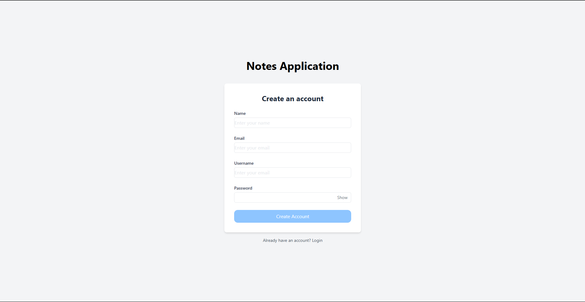

2.  Registration validation

    If any data is missing. there will be validation 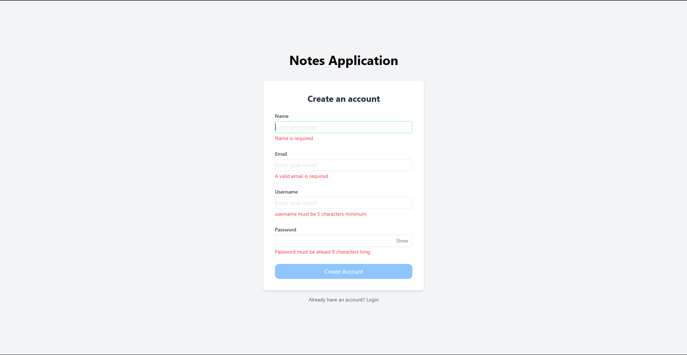

3.  Verify Email Page

    After you get the email. do click the button
    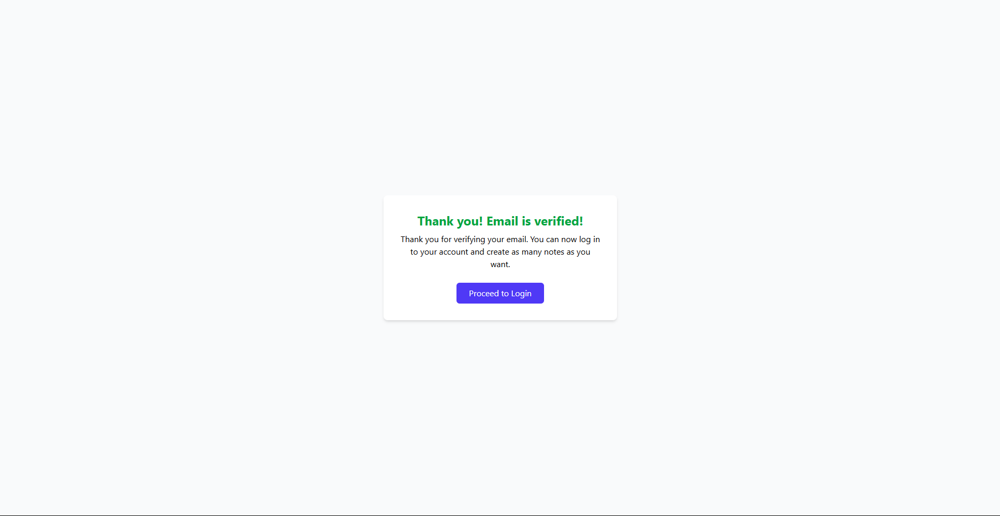

4.  Login Page

    After you verify, you can login
    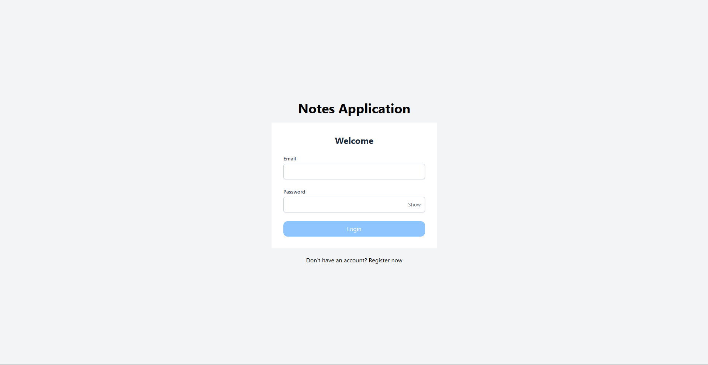

5.  Login validation

    if you dont put the necessary data. you will get error
    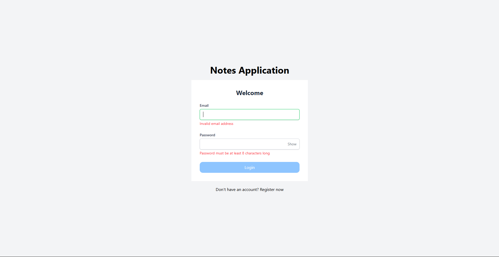

6.  Go to dashboard

    after logging in, you will go to the dashboard
    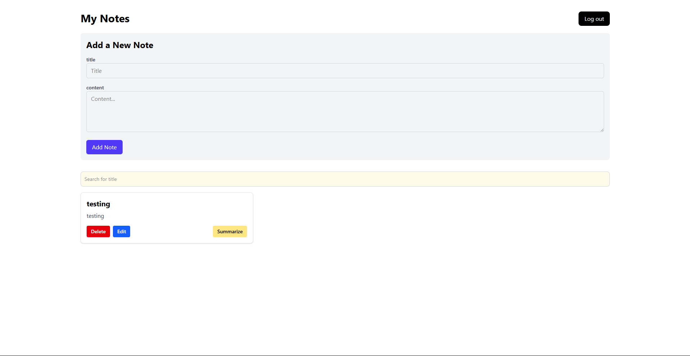

7.  Notes validation

    title and content needs to be filled.
    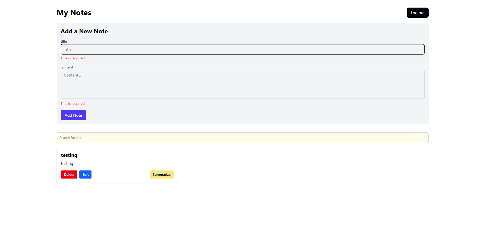

8.  Edit notes.

    There is an edit note in every card. you click it and a pop up will shows

    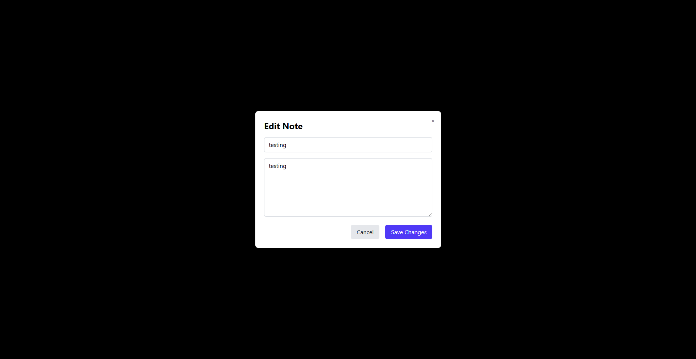

9.  Delete notes.

    You can also delete the notes. and a modal will show
    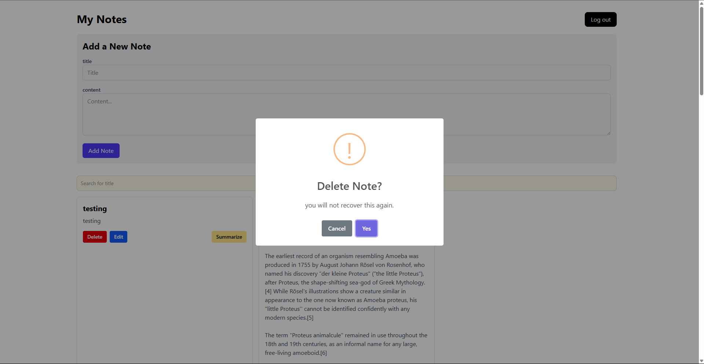

10. Summarize with ai.

    there is a summarize button
    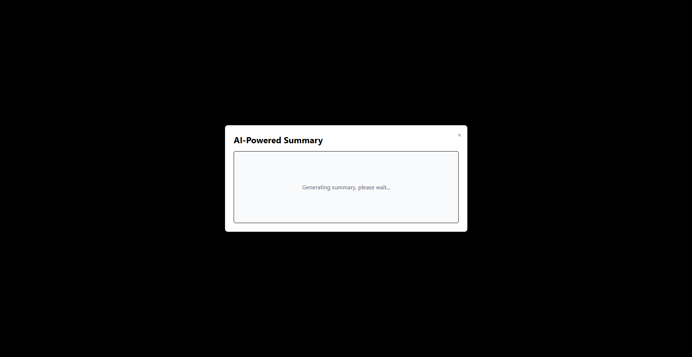

11. wait for result

    after a pop up is shown, wait for result. example result
    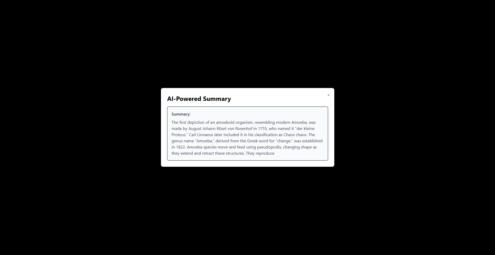

12. Log out.

    Now, you can log out by clicking the log out button

    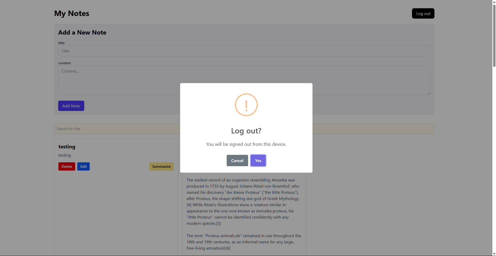
